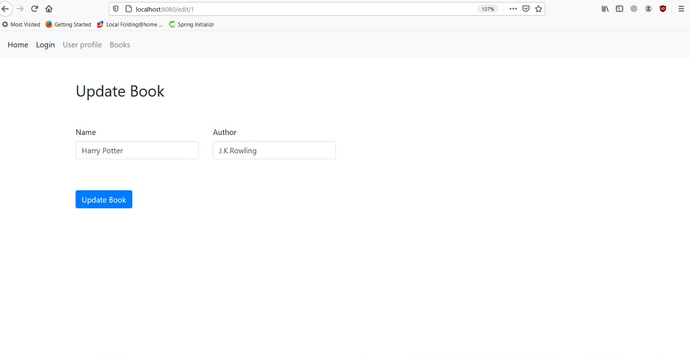
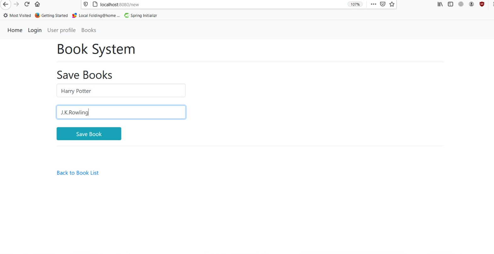
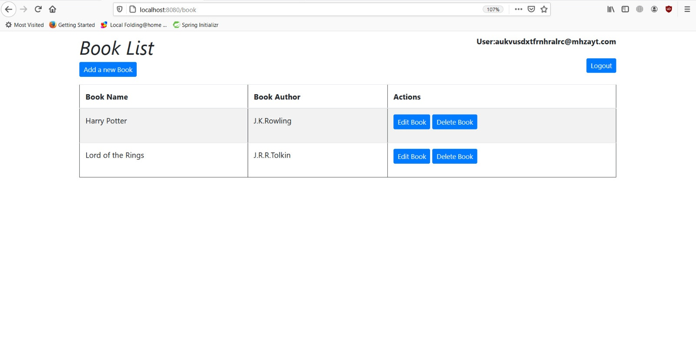

"# BooksApplication" 
A Spring Boot  Java application that allows a registered user to add,edit and delete books to a database(currently Hibernate, to be updated to other).
## Table of Contents
* [General info](#general-info)
* [Technologies](#technologies) 
* [Sources](#sources)
* [Things to be added](#things-to-be-added)
* [Example](#example) 

## General info
This project is a simple CRUD application to help me understand better Spring Boot and Spring Security.Users are registered with Okta registration.
## Technologies
Project is created with:
*Spring Boot 2.3.3
*Maven project
*spring-boot-starter-web
*H2 dataabse
*Okta
*Thymeleaf
*Jpa.
## Sources
This app is inspired by tutorials from:(https://www.baeldung.com/spring-security-okta),(https://www.baeldung.com/spring-boot-crud-thymeleaf),(https://www.javatpoint.com/spring-boot-crud-operations),
(https://howtodoinjava.com/spring-boot2/spring-boot-crud-hibernate/),(https://www.springboottutorial.com/spring-boot-crud-rest-service-with-jpa-hibernate),(https://github.com/okta/okta-spring-boot)
##Things to be added:
*A error page - you are not a registered user to replace the current if/else link in welcome template;
*Adding admin dashboard;
*switching to MySQL;
*More tests.
## Example

